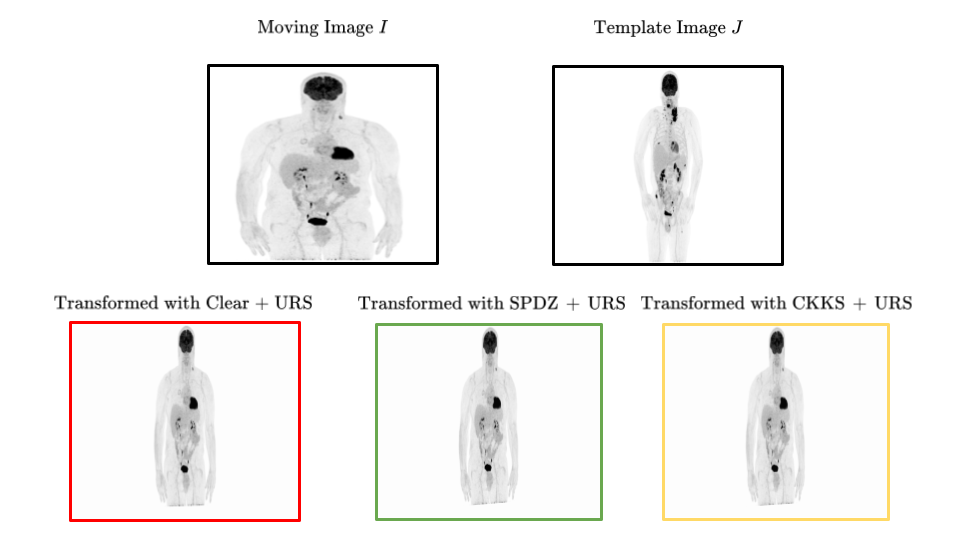

    
 
# Privacy Preserving Image Registration

 

## Description

This repository contains the official code of the research paper [Privacy Preserving Image Registration](https://arxiv.org/abs/2205.10120) accepted at [MICCAI2022](https://conferences.miccai.org/2022/en/).

## Abstract
> Image registration is a key task in medical imaging applications, allowing to represent medical images in a common spatial reference frame. Current literature on image registration is generally based on the assumption that images are usually accessible to the researcher, from which the spatial transformation is subsequently estimated. This common assumption may not be met in current practical applications, since the sensitive nature of medical images may ultimately require their analysis under privacy constraints, preventing to share the image content in clear form. In this work, we formulate the problem of image registration under a privacy preserving regime, where images are assumed to be confidential and cannot be disclosed in clear. We derive our privacy preserving image registration framework by extending classical registration paradigms to account for advanced cryptographic tools, such as secure multi-party computation and homomorphic encryption, that enable the execution of operations without leaking the underlying data. To overcome the problem of performance and scalability of cryptographic tools in high dimensions, we first propose to optimize the underlying image registration operations using gradient approximations. We further revisit the use of homomorphic encryption and use a packing method to allow the encryption and multiplication of large matrices more efficiently. We demonstrate our privacy preserving framework in linear and non-linear registration problems, evaluating its accuracy and scalability with respect to standard image registration. Our results show that privacy preserving image registration is feasible and can be adopted in sensitive medical imaging applications.
## How to run
### Dependecies
You'll need a working Python environment to run the code. 
The recommended way to set up your environment is through the Anaconda Python distribution(https://www.anaconda.com/products/distribution)
which provides the `conda` package manager. 
Anaconda can be installed in your user directory and does not interfere with the system Python installation.
### How to run
- Download the repository: `git clone https://github.com/rtaiello/PP_Image_Registration`
- Create the environment`conda create -n pp_img_regr python=3.7`
- Activate the environment`conda activate pp_img_regr`
- Install the dependencies `pip install -r requirements.txt`

## Results
* Linear Transformation - [wandb.ai](https://wandb.ai/ppir/miccai_2022_linear?workspace=user-riccardo-taiello)
* Non-Linear Transformation - [wandb.ai](https://wandb.ai/ppir/miccai_2022_linear?workspace=user-riccardo-taiello)
* Supplementary Material - [wandb.ai]()
## Authors
* **Riccardo Taiello**  - [github](https://github.com/rtaiello) - [website](https://rtaiello.github.io)
* **Melek Önen**  - [website](https://www.eurecom.fr/en/people/onen-melek)
* **Olivier Humbert**  - [website](https://www.linkedin.com/in/olivier-humbert-b14553173/)
* **Marco Lorenzi**  - [website](https://marcolorenzi.github.io/)
